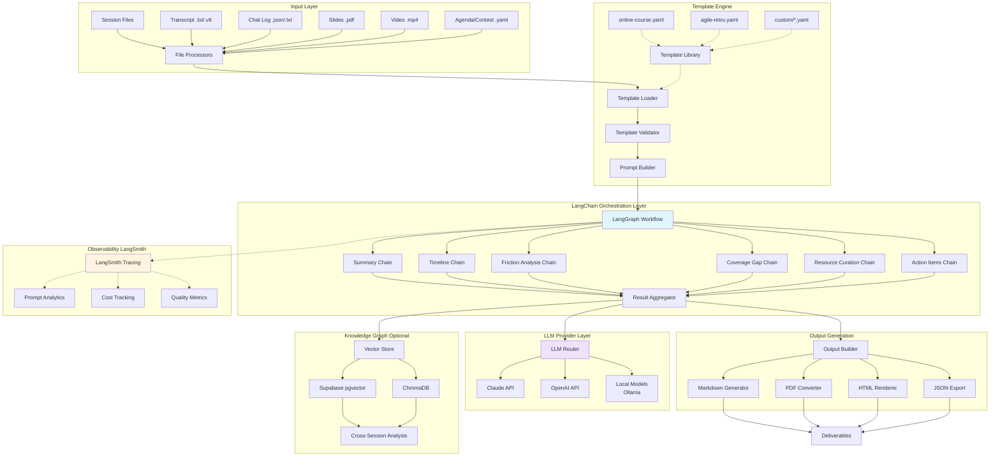
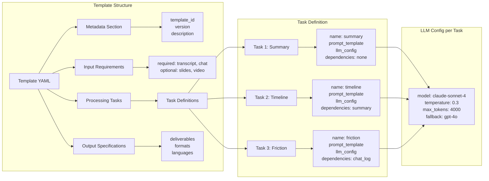
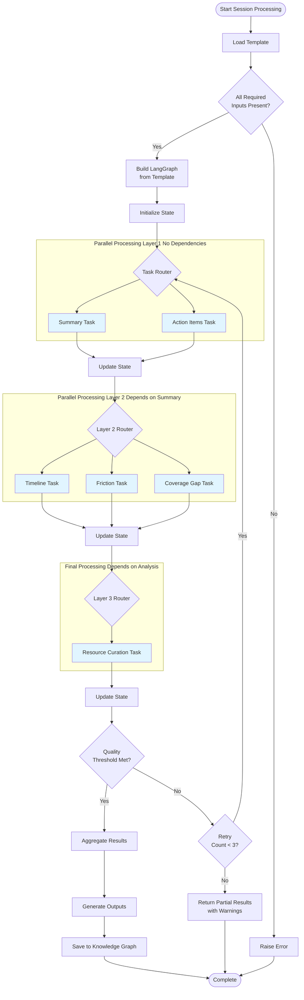
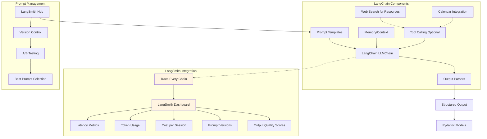
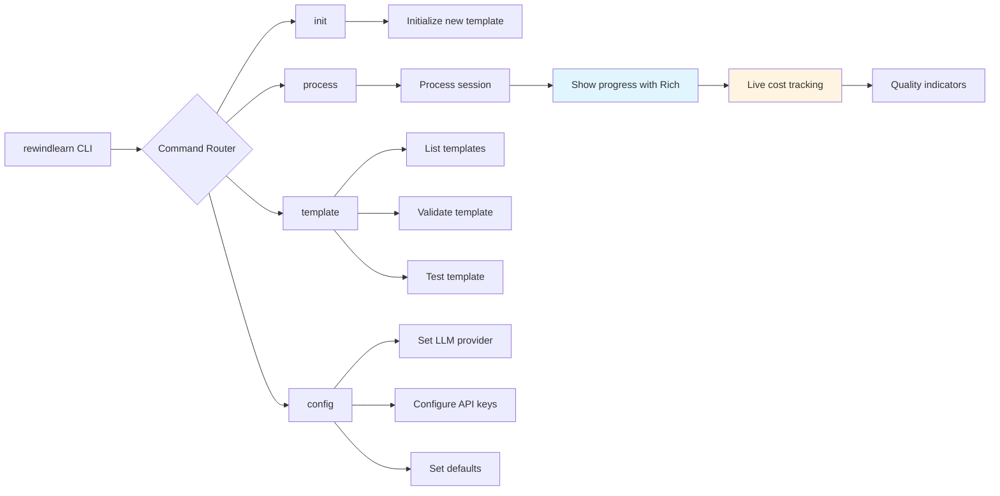
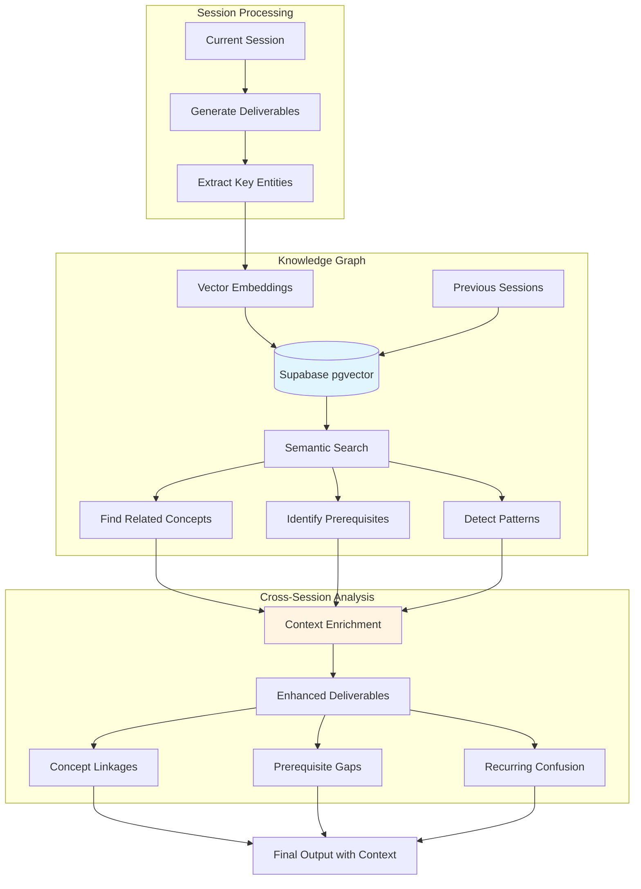
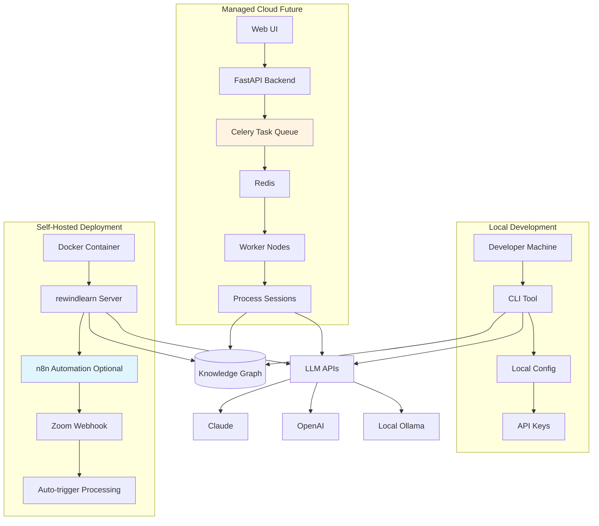

## Rewind.Learn Technical Architecture

### High-Level System Overview



---

## Detailed Component Architecture

### 1. Template System Architecture



**Template YAML Example:**

```yaml
template_id: "online-course-v1"
name: "Online Course Session"
version: "1.0"
description: "Process online course sessions into comprehensive study materials"

# Your specific prompts
course_context:
  course_name: "AI Engineering"  # or "AI Generalist"
  instructor: "Sri"
  session_format: "2-3 hour lecture + hands-on"

inputs:
  required:
    - transcript
    - chat_log
  optional:
    - slides
    - previous_session_summary
    - course_outline

processing:
  tasks:
    - name: "session_summary"
      prompt_template: |
        You are analyzing a session from {{course_name}}.
        
        Transcript:
        {{transcript}}
        
        Create a comprehensive summary covering:
        - Main topics discussed
        - Key learning objectives
        - Critical takeaways
        
      llm_config:
        model: "claude-sonnet-4"
        temperature: 0.3
        max_tokens: 4000
      dependencies: []
      
    - name: "concept_timeline"
      prompt_template: |
        Based on the session summary and transcript, create a chronological timeline
        of concepts covered, organized into 5-10 minute segments.
        
        Summary:
        {{session_summary}}
        
        Transcript:
        {{transcript}}
        
      llm_config:
        model: "claude-sonnet-4"
        temperature: 0.2
      dependencies: ["session_summary"]
      
    - name: "student_friction_analysis"
      prompt_template: |
        Analyze the chat log for signs of student confusion, questions, and struggles.
        
        Chat Log:
        {{chat_log}}
        
        Session Context:
        {{session_summary}}
        
        Identify:
        - Topics that confused students
        - Repeated questions
        - Concepts needing review
        
      llm_config:
        model: "gpt-4o"
        temperature: 0.4
      dependencies: ["session_summary"]

outputs:
  deliverables:
    - session_summary
    - concept_timeline
    - friction_analysis
    - coverage_gaps
    - learning_resources
    - action_items
  formats:
    - markdown
    - pdf
  languages:
    - en
```

---

### 2. LangGraph Workflow Architecture



**LangGraph State Schema:**

```python
from typing import TypedDict, List, Optional
from langgraph.graph import StateGraph

class SessionState(TypedDict):
    # Inputs
    transcript: str
    chat_log: str
    slides: Optional[str]
    course_context: dict
    
    # Intermediate results
    session_summary: Optional[str]
    concept_timeline: Optional[str]
    friction_analysis: Optional[str]
    coverage_gaps: Optional[str]
    learning_resources: Optional[str]
    action_items: Optional[str]
    
    # Metadata
    processing_status: dict
    error_log: List[str]
    quality_scores: dict
    cost_tracking: dict
```

---

### 3. LangChain Integration Architecture



**Example LangChain Implementation:**

```python
from langchain.prompts import PromptTemplate
from langchain.chains import LLMChain
from langchain.output_parsers import PydanticOutputParser
from langchain_anthropic import ChatAnthropic
from pydantic import BaseModel, Field
from langsmith import traceable

class SessionSummary(BaseModel):
    main_topics: List[str] = Field(description="3-5 main topics covered")
    key_concepts: List[str] = Field(description="Critical concepts explained")
    learning_objectives: List[str] = Field(description="What students should know")
    executive_summary: str = Field(description="2-3 sentence overview")

@traceable(name="generate_session_summary")
def generate_summary(transcript: str, course_context: dict) -> SessionSummary:
    parser = PydanticOutputParser(pydantic_object=SessionSummary)
    
    prompt = PromptTemplate(
        template="""You are analyzing a {course_name} session.
        
        Transcript:
        {transcript}
        
        {format_instructions}
        """,
        input_variables=["course_name", "transcript"],
        partial_variables={"format_instructions": parser.get_format_instructions()}
    )
    
    llm = ChatAnthropic(model="claude-sonnet-4", temperature=0.3)
    chain = LLMChain(llm=llm, prompt=prompt)
    
    result = chain.run(
        course_name=course_context['course_name'],
        transcript=transcript
    )
    
    return parser.parse(result)
```

---

### 4. CLI Architecture with Rich UI



**CLI Commands:**

```bash
# Initialize a new session processing
rewindlearn init --template online-course --course "AI Engineering"

# Process a session
rewindlearn process \
  --template ai-engineering.yaml \
  --transcript session-01.txt \
  --chat chat-01.json \
  --output study-guides/

# With live progress tracking
rewindlearn process session-01/ --watch

# Test template with sample data
rewindlearn template test online-course.yaml --sample data/sample-session/

# Configure LLM providers
rewindlearn config set-provider claude --api-key $ANTHROPIC_API_KEY
rewindlearn config set-provider openai --api-key $OPENAI_API_KEY

# View processing history and costs
rewindlearn history --last 10 --show-costs
```

---

### 5. Knowledge Graph & Cross-Session Intelligence



**Knowledge Graph Schema:**

```python
# Supabase tables
sessions_table = {
    "id": "uuid",
    "course_name": "text",
    "session_number": "int",
    "date": "timestamp",
    "summary": "text",
    "concepts": "jsonb",  # List of concepts covered
    "embedding": "vector(1536)"  # For semantic search
}

concepts_table = {
    "id": "uuid",
    "session_id": "uuid",
    "concept_name": "text",
    "definition": "text",
    "related_concepts": "jsonb",
    "confusion_level": "float",  # From friction analysis
    "embedding": "vector(1536)"
}

student_confusion_table = {
    "id": "uuid",
    "session_id": "uuid",
    "topic": "text",
    "question_count": "int",
    "resolved": "boolean",
    "follow_up_needed": "boolean"
}
```

---

### 6. Deployment Architecture



---

## Technology Stack Summary

### Core Framework
- **LangChain**: Chain orchestration, prompt management
- **LangGraph**: Workflow state management, task dependencies
- **LangSmith**: Observability, prompt versioning, A/B testing

### LLM Providers
- **Primary**: Anthropic Claude (Sonnet 4)
- **Secondary**: OpenAI (GPT-4o)
- **Local**: Ollama (Llama 3, Mistral)

### Data & Storage
- **Vector DB**: Supabase (pgvector) for knowledge graph
- **Cache**: Redis for intermediate results
- **Files**: Local filesystem / S3 for session artifacts

### Output Generation
- **Markdown**: Python-Markdown library
- **PDF**: WeasyPrint or Pandoc
- **HTML**: Jinja2 templates

### CLI & UX
- **CLI**: Typer (Python)
- **Progress**: Rich library (beautiful terminal UI)
- **Config**: YAML + Pydantic for validation

### Automation (Optional)
- **n8n**: Workflow automation
- **Webhooks**: Zoom/Teams integration

---

## Development Phases

### Phase 1: Core Engine
1. Template loader and validator
2. Single LangChain for one task (summary)
3. Basic CLI (`rewindlearn process`)
4. LangSmith integration for tracing

### Phase 2: Full Template Support
1. LangGraph workflow builder
2. All 6 deliverables working
3. Parallel task execution
4. Output generation (Markdown + PDF)

### Phase 3: Knowledge Graph
1. Supabase setup with pgvector
2. Session embedding and storage
3. Cross-session concept linking
4. Enhanced deliverables with context

### Phase 4: Polish & Deploy
1. Error handling and retries
2. Cost tracking and optimization
3. Documentation
4. Docker container

---

